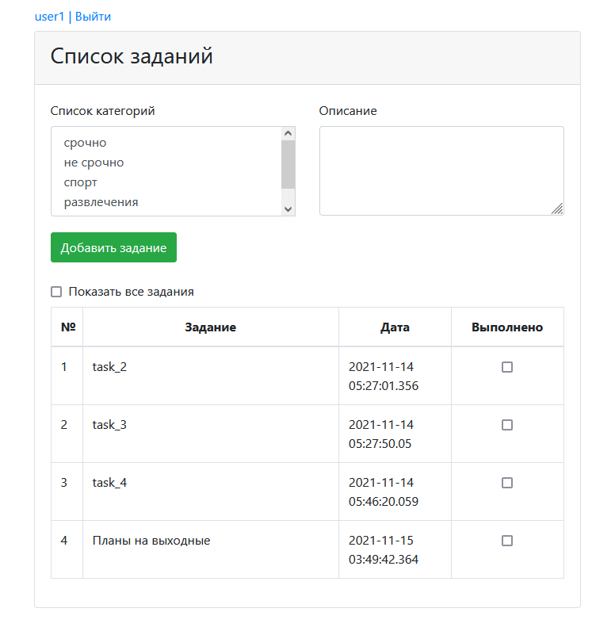
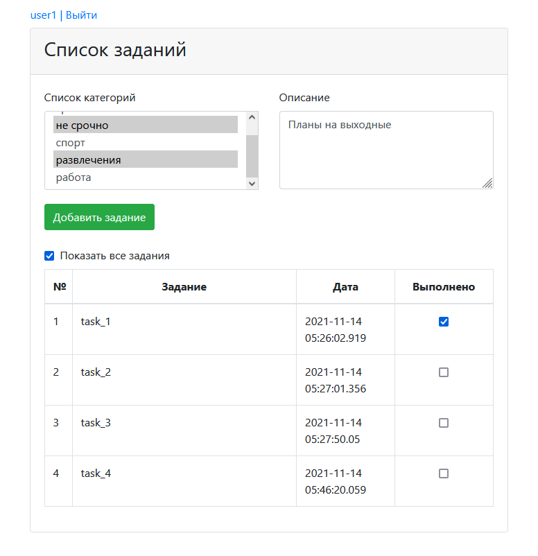
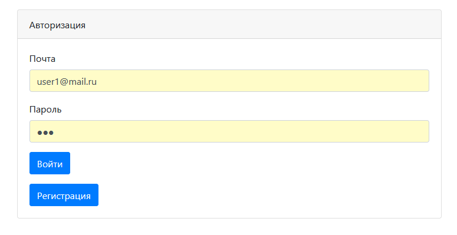

[](https://travis-ci.com/VadimShein/job4j_todo)


# <p align="center">Приложение список дел</p>

## Описание:
Приложение отображает список актуальных задач пользователя. Пользователь может создавать и видеть только свой список задач.
Каждая задача имеет описание, категории и статус выполнения.
После того, как пользователь отметит задачу выполненной, она исчезнет из списка.
Для просмотра всей истории задач нужно поставить галочку «показать все задания». 
Для использования приложения необходимо зарегистрироваться и авторизоваться.


## Используемые технологии:
* Java 13 
* HTML, CSS, Bootstrap, JavaScript, AJAX
* JSP, Servlets, Tomcat
* PostgreSQL, Hibernate


## Скриншоты:
1. Главная страница. Список актуальных заданий.



2. Список всех заданий пользователя.



3. Форма авторизации и регистрации.




## Запуск проекта:
1. Скопировать проект 
```
git clone https://github.com/VadimShein/job4j_todo
```

2. Создать базу данных todo и таблицы из файла src/main/resources/db/schema.sql

3. Выполнить сборку проекта 
```
mvn clean package -DskipTests
```

4. Запустить приложение, адрес по умолчанию  [http://localhost:8080/job4j_todo/index.jsp](http://localhost:8080/job4j_todo/index.jsp)
Получившийся после сборки проекта файл todo-1.0.war скопировать в каталог webapps Tomcat сервера. 
Выполнить настройку на веб-сервере для доступа к проекту через вебраузер.


## Контакты:
[](https://t.me/SheinVadim)
[](mailto:shein.v94@mail.ru)
